# Examen1
Este es el examen de Maximo 
## Ejecicio1

Examen repetri Ex1 

Para añadir un Repositorio debemos crear un repositorio en github, abrir la pestaña code y copiar el enlace  
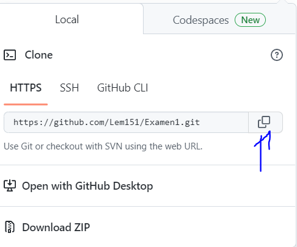
-------
Luego lo añadimos al gitbash con el siguiente comando donde después de clone es el link que copiamos 

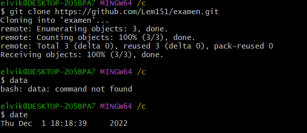
-------
Con las siguientes líneas sirven para crear el archivo, subirlo y pushearlo

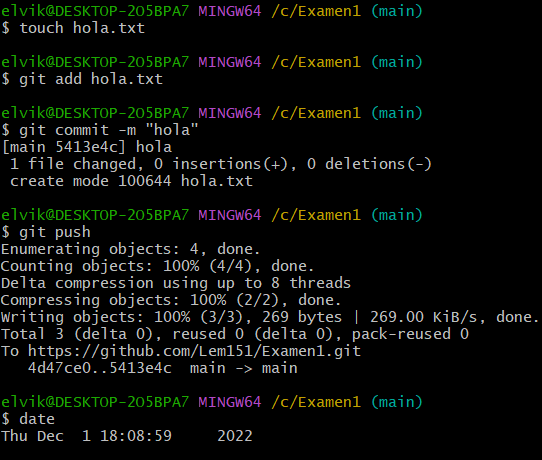
-----

Con este comando sacamos el archivo de Ghub

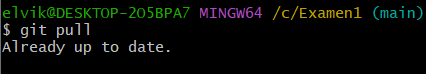
----
Para volver al estado original de un archivo cuando todavía no se ha hecho add

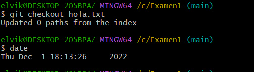
----
Si ya se ha hecho el add y quiero volver a una versión anterior

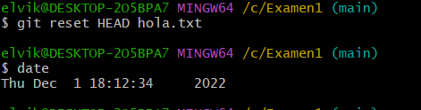
----
La opción --oneline, nos muestra la información de cada commit en una línea.
La opción --all, nos muestra todos los commits.

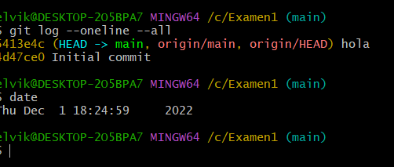
-----
1. Vamos a ver el contenido del archivo README.md en el commit actual.

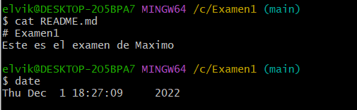
------

Vamos a movernos al primer commit.

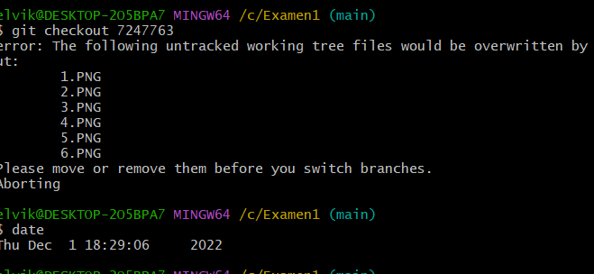
-----
Cat Readme

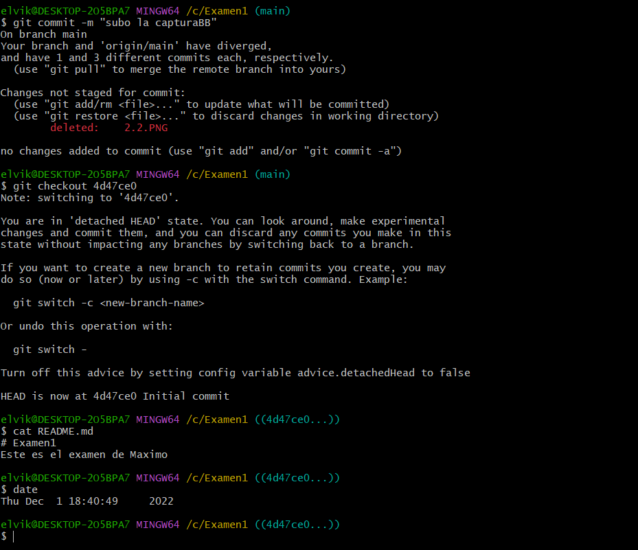
------
Por último,
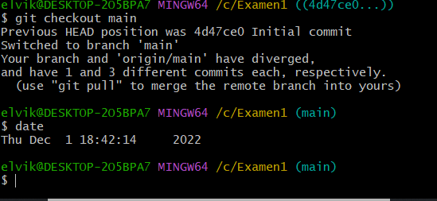
-----
